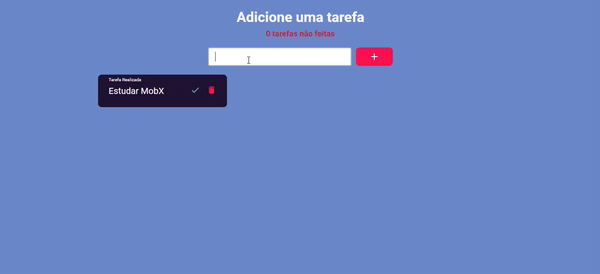

<div align="center">
  
</div>
&nbsp;
<div align="center">
  <a href="todo-0app.netlify.app">Acesar demostração</a>
</div>

## :bookmark: Sobre

Aplicação web de Todos para prática de tecnologias como Typescript, MobX e SASS.

## :computer: Tecnologias utilizadas

- MobX
- React
- SASS
- TypeScript

## :open_file_folder: Como baixar o projeto

```bash
  # Clonar repositório
  $ git clone https://github.com/netohelvecio/todo_app.git

  # Entrar na pasta do repositório
  $ cd todo_app

  # Instalar dependências
  $ yarn
  # ou
  $ npm -i

  # Inicar projeto
  $ yarn star
  #ou
  $ npm run start
```

---

Desenvolvido por Helvécio Neto
